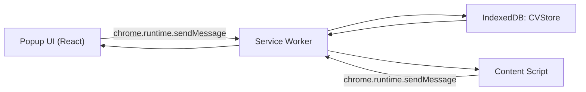
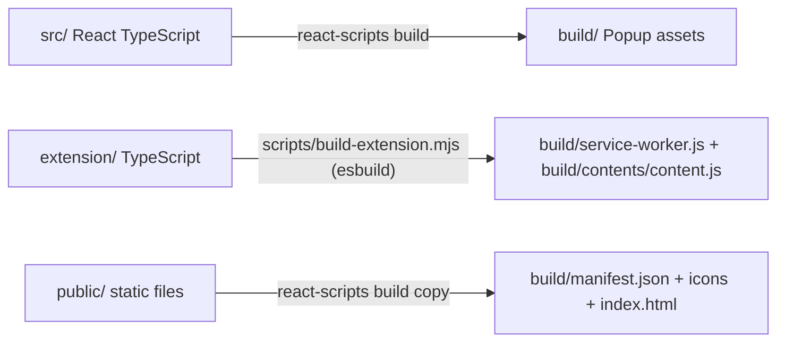

# 아키텍처

## 전체 구조

```text
.
├── public/
│   ├── manifest.json
│   ├── index.html
│   └── icon/
├── src/
│   ├── api/
│   ├── components/
│   ├── hooks/
│   ├── stores/
│   ├── types/
│   ├── styles/
│   ├── App.tsx
│   └── index.tsx
├── extension/
│   ├── service-worker.ts
│   ├── contents/
│   └── modules/
├── scripts/
│   └── build-extension.mjs
├── build/
│   ├── service-worker.js
│   └── contents/content.js
├── package.json
└── README.md
```

## 런타임 구성

- Popup UI: `src/`의 React/TypeScript 앱입니다. `public/index.html`을 통해 확장 프로그램 팝업으로 실행됩니다.
- Background Service Worker: 원본은 `extension/service-worker.ts`이고, 빌드 후 `build/service-worker.js`로 생성됩니다. IndexedDB 작업을 담당합니다.
- Content Script: 원본은 `extension/contents/content.ts`이고, 빌드 후 `build/contents/content.js` 단일 파일로 생성됩니다. 모든 `http`, `https` 페이지에 주입되어 단축키와 선택 텍스트를 처리합니다.
- IndexedDB 모듈: 원본은 `extension/modules/` 아래에 있습니다. DB 연결, store 접근, CRUD 서비스를 제공합니다.
- 정적 파일: `public/`에는 `manifest.json`, `index.html`, icon, 정적 문서만 둡니다. TypeScript 원본과 런타임 JavaScript 원본은 두지 않습니다.

## Manifest

`public/manifest.json`은 Manifest V3 설정입니다.

- `background.service_worker`: `service-worker.js`
- `content_scripts`: `contents/content.js` 단일 번들 파일을 모든 HTTP/HTTPS 페이지에 주입
- `action.default_popup`: `index.html`
- `_execute_action`: `Ctrl+B` 또는 `Command+B`로 팝업 열기

`npm run build`는 `public/manifest.json`을 `build/manifest.json`으로 복사한 뒤, `scripts/build-extension.mjs`로 manifest가 참조하는 `build/service-worker.js`와 `build/contents/content.js`를 생성합니다.

## 메시지 흐름

Popup UI와 Content Script는 직접 IndexedDB를 다루지 않고 `chrome.runtime.sendMessage`로 Service Worker에 요청합니다.



## Popup UI 계층

- `src/components/header`: 현재 리스트 선택, 리스트 추가/수정 버튼
- `src/components/Main`: 커맨드 목록, 새 커맨드 버튼, 모달 렌더링
- `src/components/Footer`: 전체 커맨드 삭제 버튼
- `src/components/Modal`: 리스트/커맨드 추가, 수정, 삭제 확인 모달
- `src/styles`: 전역 스타일과 공통 styled-components

## 상태 관리

`src/stores/`는 Zustand를 사용합니다.

- `ListStore.ts`: 현재 선택된 리스트 이름
- `CommandStore.ts`: 현재 선택된 커맨드
- `ModalStore.ts`: 각 모달의 열림/닫힘 상태

서버 상태에 가까운 IndexedDB 데이터는 TanStack Query 훅으로 가져오고 변경 후 invalidate합니다.

## API와 Hook 계층

`src/api/`는 `chrome.runtime.sendMessage` 호출을 감싼 함수입니다.

- `getList`: 전체 리스트 조회
- `getListByName`: 특정 리스트 조회
- `postList`: 리스트 추가
- `postCommand`: 커맨드 추가
- `putEditList`: 리스트 목록 수정
- `putEditCommand`: 단일 커맨드 수정
- `putEditCommands`: 커맨드 목록 수정
- `deleteCommand`: 단일 커맨드 삭제
- `deleteCommands`: 현재 리스트의 커맨드 전체 삭제

`src/hooks/`는 TanStack Query의 `useQuery`, `useMutation`과 모달/스토어 상태를 조합합니다.

`src/types/`는 Popup UI와 Extension Script가 공유하는 도메인 타입과 메시지 타입을 정의합니다.

- `domain.ts`: 리스트, 커맨드, 현재 리스트, IndexedDB record 타입
- `messages.ts`: `chrome.runtime.sendMessage` request/response 계약
- `assets.d.ts`: SVG import 선언

## IndexedDB 구조

DB 이름은 `CVStore`, 버전은 `1`입니다.

### `list` object store

리스트와 커맨드를 저장합니다.

```js
{
  id: "uuid",
  name: "리스트 이름",
  commands: ["커맨드 텍스트"]
}
```

- `autoIncrement: true`
- `name` index 보유
- 리스트는 최대 10개
- 각 리스트의 커맨드는 최대 10개

### `currentList` object store

단축키 동작에서 사용하는 현재 리스트 이름을 저장합니다.

```js
{
  name: "현재 리스트 이름"
}
```

현재 구현에서는 key `1`에 현재 리스트 이름을 저장합니다.

## Content Script 흐름

`extension/contents/content.ts`는 키보드 이벤트와 선택 영역 변경을 감지합니다. 빌드 후에는 `build/contents/content.js`로 실행됩니다.

- `selectionchange`: 현재 선택된 텍스트를 `currentSelection`에 저장
- `Shift + 숫자`: 현재 리스트 선택
- `Alt + 숫자`: 현재 리스트의 특정 커맨드를 클립보드에 복사
- `Shift + Alt + 숫자`: 현재 선택 텍스트를 현재 리스트의 특정 인덱스에 저장

숫자 `0`은 10번째 항목으로 처리됩니다.

## 빌드 흐름



- `npm run typecheck`: TypeScript 타입 검사를 수행합니다.
- `npm run build:extension`: Extension 런타임 스크립트만 `build/`에 번들합니다.
- `npm run build`: Popup UI와 Extension 런타임을 모두 빌드합니다.
- Chrome에 로드할 대상은 `public/`이 아니라 `build/` 디렉토리입니다.
